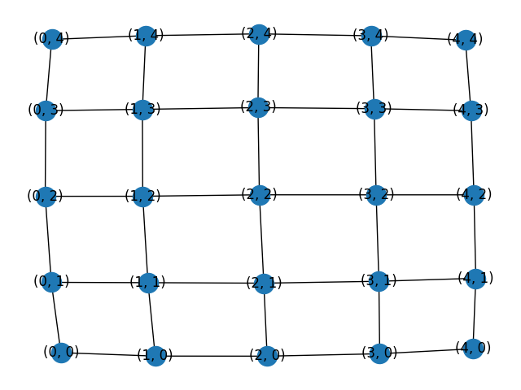
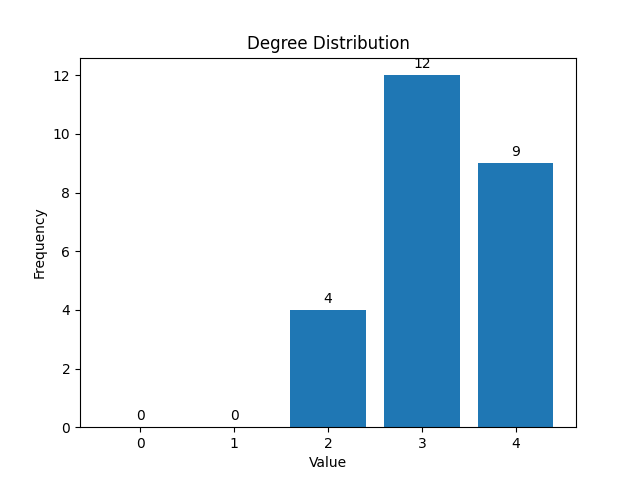
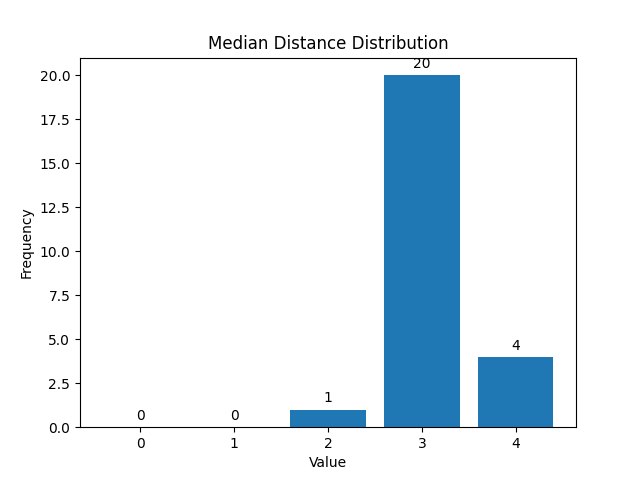

---  
share: "true"  
---  
# Lattice  
## Lattice  
  
  
  
Number of Vertices: 25  
  
Number of Edges: 40  
  
Average Degree: 3.2  
  
Degree Distribution:  
  
  
  
| Node Index | Median Distance |  
|------------|------------|  
| 0 | 4 |  
| 1 | 3 |  
| 2 | 3 |  
| 3 | 3 |  
| 4 | 4 |  
| 5 | 3 |  
| 6 | 3 |  
| 7 | 3 |  
| 8 | 3 |  
| 9 | 3 |  
| 10 | 3 |  
| 11 | 3 |  
| 12 | 2 |  
| 13 | 3 |  
| 14 | 3 |  
| 15 | 3 |  
| 16 | 3 |  
| 17 | 3 |  
| 18 | 3 |  
| 19 | 3 |  
| 20 | 4 |  
| 21 | 3 |  
| 22 | 3 |  
| 23 | 3 |  
| 24 | 4 |  
  
Median Distance Distribution:  
  
  
  
Radius: 4  
  
Diameter: 8  
  
Density: 0.13333333333333333  
  
