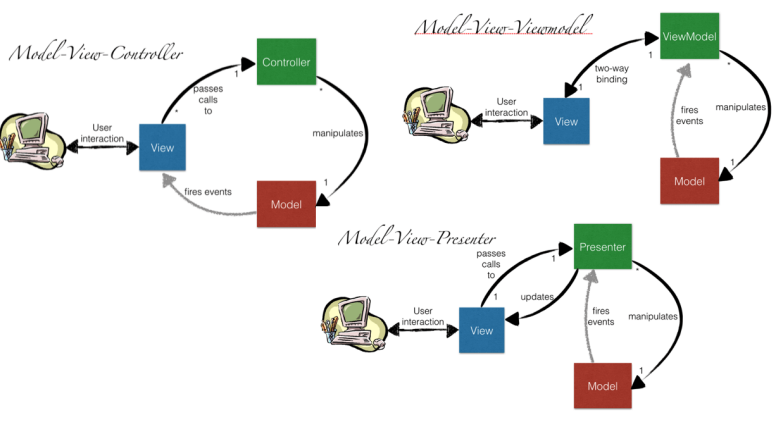

---  
share: "true"  
---  
# MVP Pattern  
  
In good design there is a split between UI and Data code, also called Business/Domain Logic and User Interface  
  
UI is also split between Display Code and Input Processing code, Split these for same reasons  
  
More convienent  
More maintainable  
More Reusable  
More convenient  
  
Additionally UI split b/c testing input processing code is easier the display code so testing is made better by the split as well  
  
  
  
  
  
  
