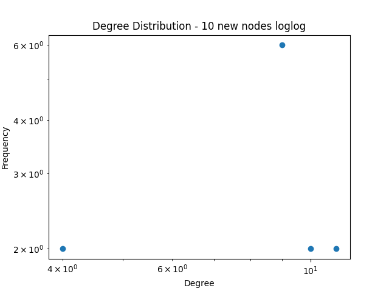
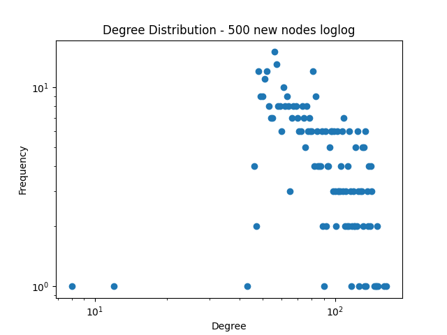
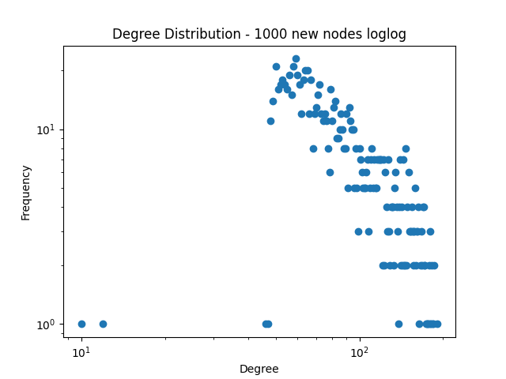

---  
share: "true"  
---  
# Summary  
  
| Number of New Nodes (Cycles) | 1_per | 10_per | 50_per | Networkx |  
| ----------------------------- | ------| -------| -------| ---------|  
| 10                            |  |  |  |  |  
| 50                            |  |  |  |  |  
| 100                           |  |  |  |  |  
| 500                           |  |  |  |  |  
| 1000                          |  |  |  |  |  
| 5000                          |  |  |  |  |  
