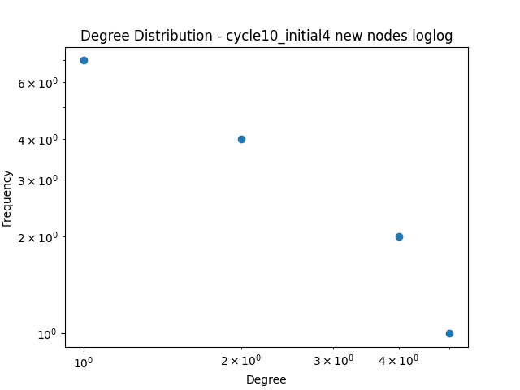
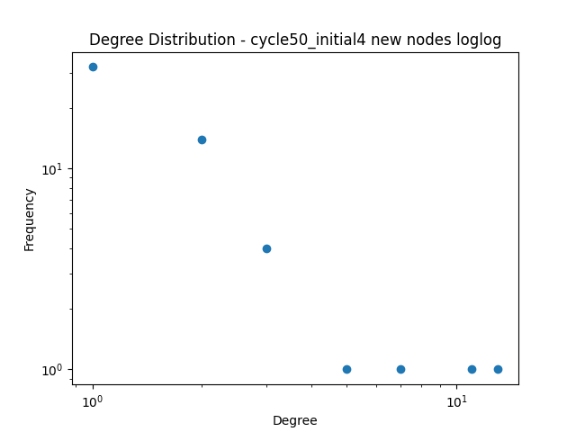
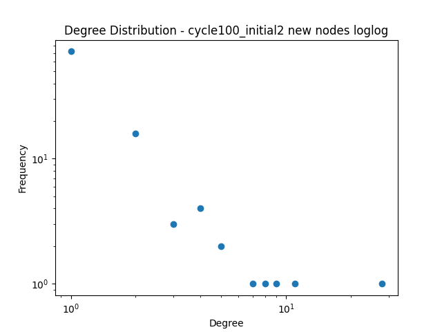
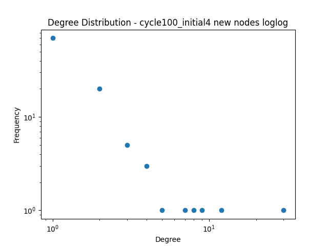
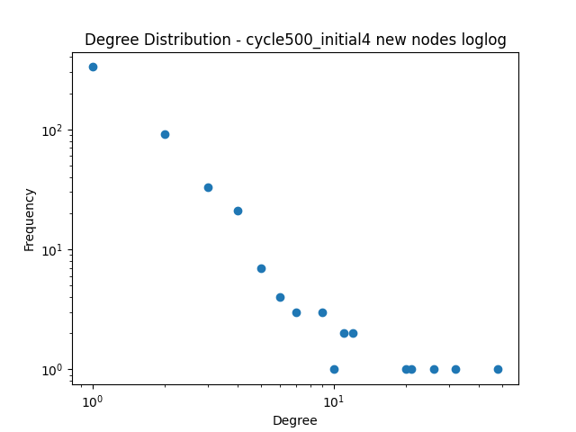
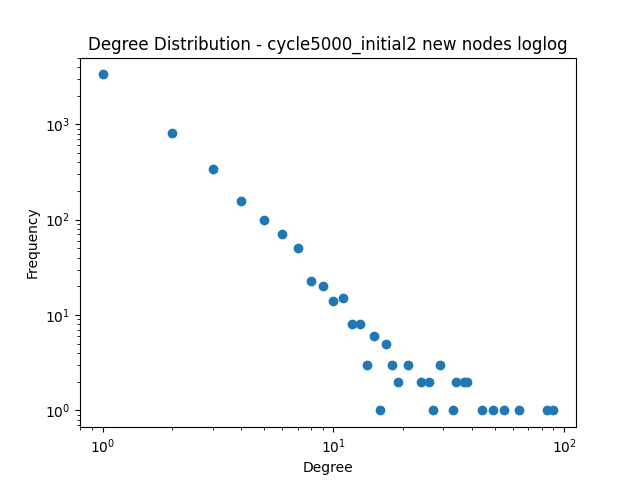
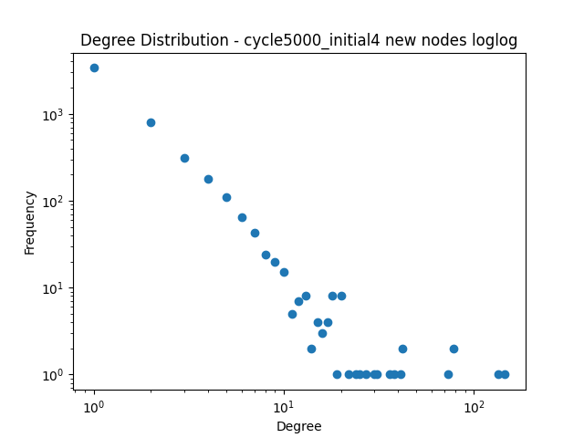

---  
share: "true"  
---  
# graph_summary  
  
| Number of New Nodes (Cycles) | 2 | 4 | 16 | 1024 |  
| ----------------------------- | ------------------------------- | ------------------------------- | ------------------------------- | ------------------------------- |  
| 10 |  |  |  |  |  
| 50 |  |  |  |  |  
| 100 |  |  |  |  |  
| 500 |  |  |  |  |  
| 1000 |  |  |  |  |  
| 5000 |  |  |  |  |  
  
### Questions  
1. Choose some of the interesting results and plot the histogram of the degree distribution. Using the "log-log" plot technique discussed in class, discuss whether the network is scale free.  
	1. As the number of initial nodes increases the fewer cycles are needed for the graph to look like a line   
2. Discuss where the "log-log" technique breaks, meaning look at the plots and talk about where and part of the plot doesn't look like a straight line in "log-log" space.  
	1. The upper and lower ends tend to be bad, lots of small member, and few large ones  
3. Discuss differences you saw in your implementation of the algorithm and NetworkX's implementation. You might not see any.  
	1. I didn't notice any differences  
4. Describe what you observed from your animation and relate it to the phrase "the rich get richer". Discuss what this means for why some networks evolve to display the scale-free property.  
	1. It looks like the early adopters tend to be more connected to existing nodes. This feels analogous to how the first few folks to adopt something that gets popular tend to benefit the most from a fad or trend.  
