---  
share: "true"  
---  
# initial_1024  
  
| Number of New Nodes (Cycles) | Graph | Degree Distribution | Degree loglog Distribution |  
| ----------------------------- | ----- | -------------------- | --------------------------- |  
| 10 |  | 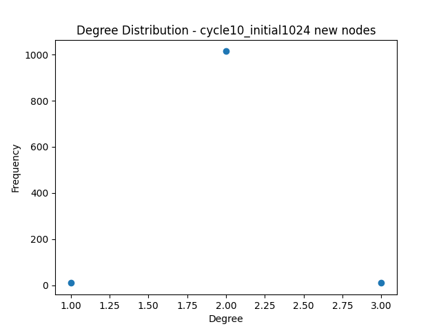 | 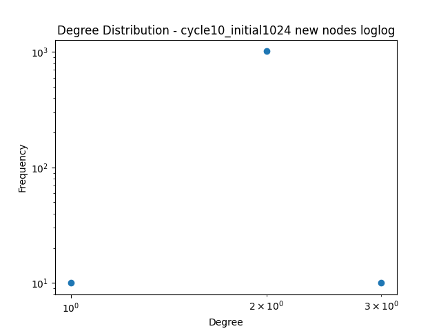 |  
| 50 | 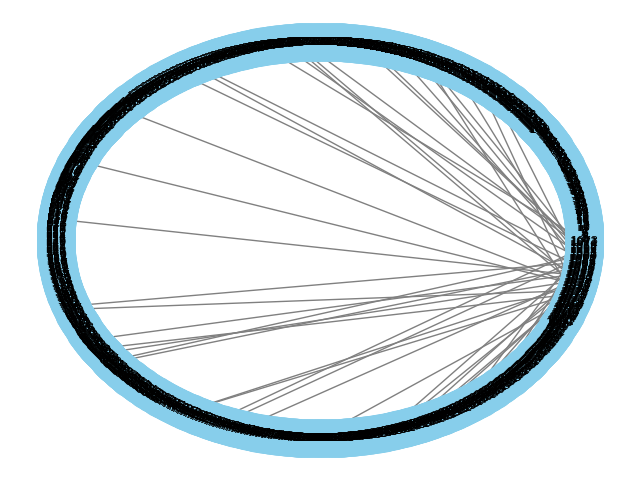 |  | 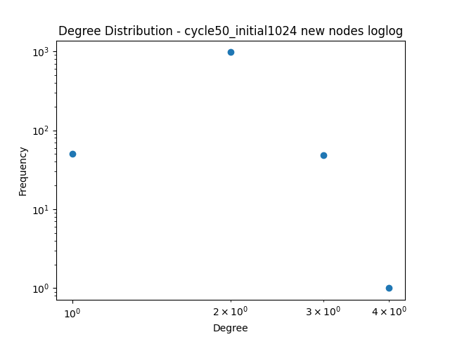 |  
| 100 | 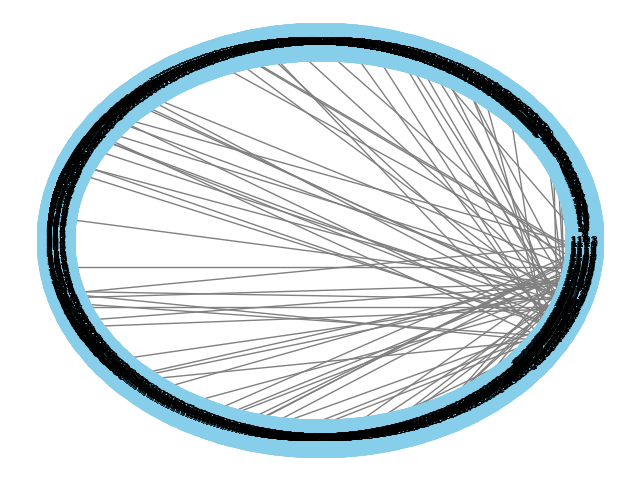 | 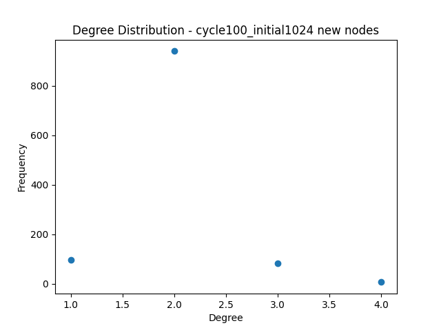 |  |  
| 500 | 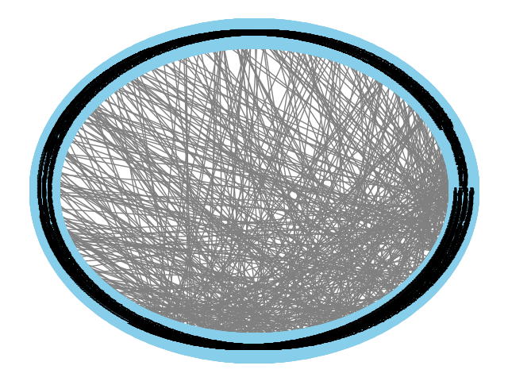 | 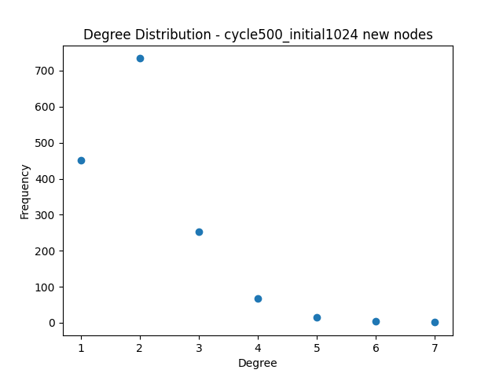 |  |  
| 1000 | 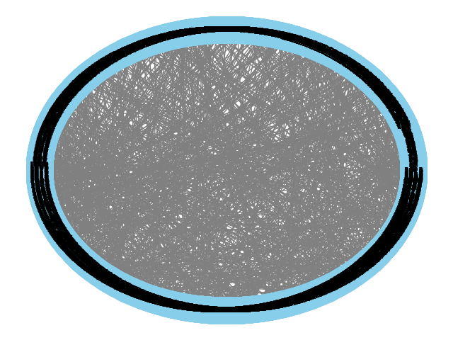 | 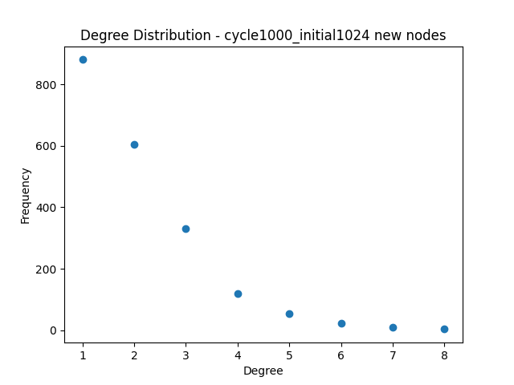 | 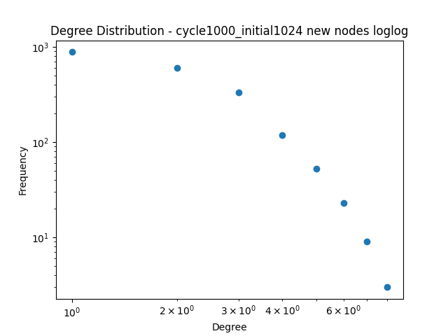 |  
| 5000 | 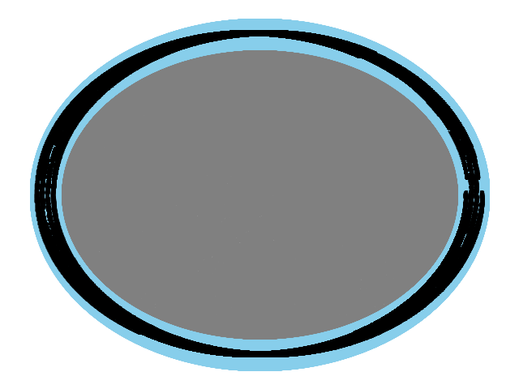 | 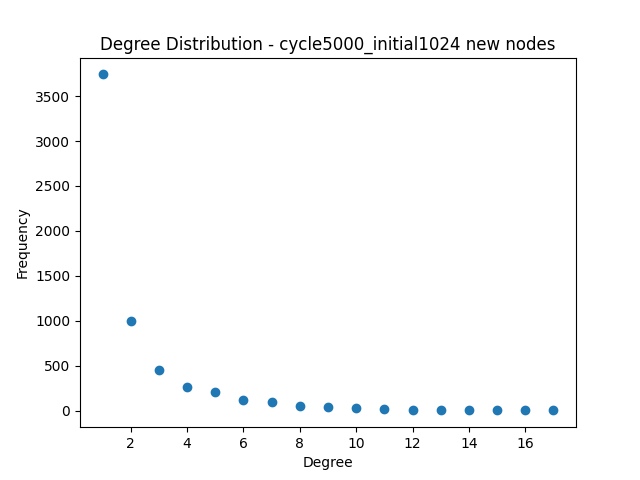 |  |  
