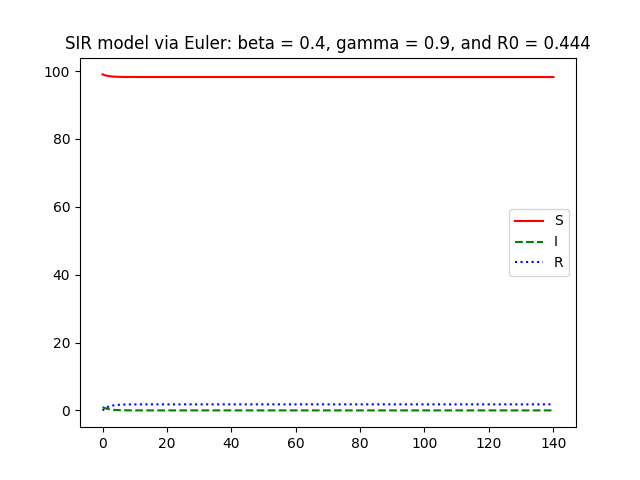
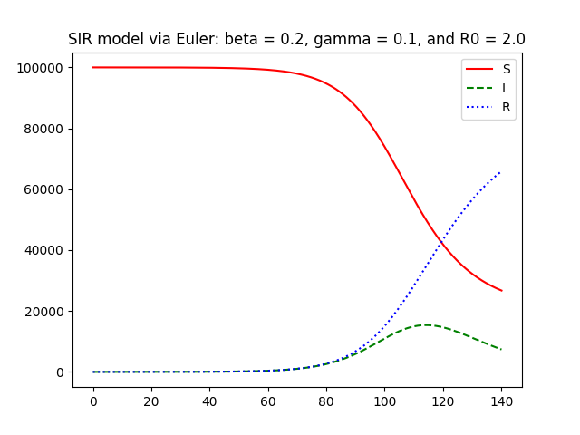
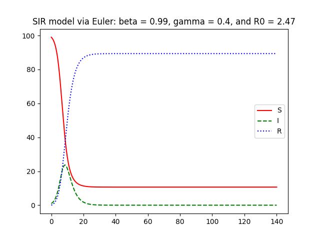
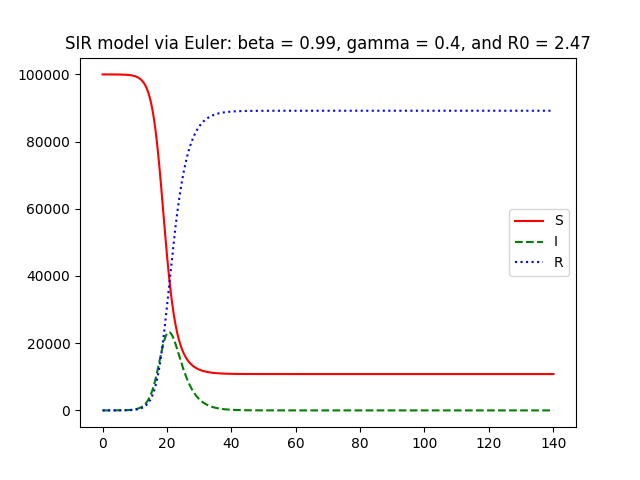
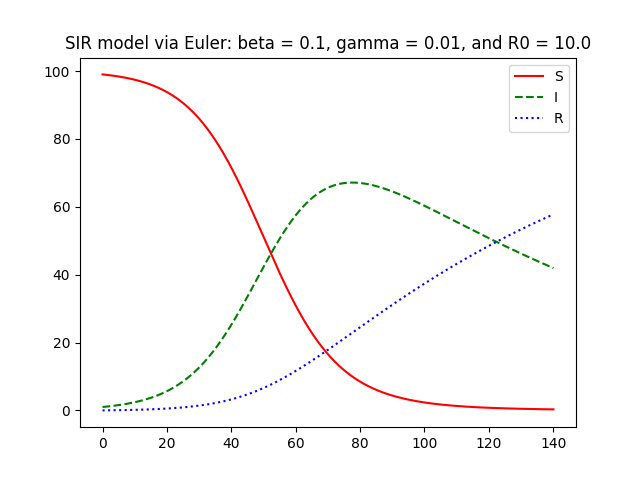

---  
share: "true"  
---  
# results_table  
  
| N      | Beta | Gamma | R0     | Image                                   |  
| ------ | ---- | ----- | ------ | --------------------------------------- |  
| 100    | 0.01 | 0.1   | 0.1    |      |  
| 100000 | 0.01 | 0.1   | 0.1    |   |  
| 100    | 0.01 | 0.2   | 0.05   |      |  
| 100    | 0.1  | 0.2   | 0.5    |       |  
| 100    | 0.2  | 0.4   | 0.5    |       |  
| 100    | 0.4  | 0.8   | 0.5    |       |  
| 100000 | 0.01 | 0.2   | 0.05   |   |  
| 100000 | 0.1  | 0.2   | 0.5    |    |  
| 100000 | 0.2  | 0.4   | 0.5    |    |  
| 100000 | 0.4  | 0.8   | 0.5    |    |  
| 100    | 0.01 | 0.4   | 0.025  |      |  
| 100    | 0.1  | 0.4   | 0.25   |       |  
| 100    | 0.2  | 0.8   | 0.25   |       |  
| 100000 | 0.01 | 0.4   | 0.025  |   |  
| 100000 | 0.1  | 0.4   | 0.25   |    |  
| 100000 | 0.2  | 0.8   | 0.25   |    |  
| 100    | 0.01 | 0.99  | 0.0101 |     |  
| 100    | 0.01 | 0.99  | 0.0101 |     |  
| 100    | 0.1  | 0.99  | 0.101  |      |  
| 100    | 0.1  | 0.99  | 0.101  |      |  
| 100000 | 0.01 | 0.99  | 0.0101 |  |  
| 100000 | 0.01 | 0.99  | 0.0101 |  |  
| 100000 | 0.1  | 0.99  | 0.101  |   |  
| 100000 | 0.1  | 0.99  | 0.101  |   |  
| 100    | 0.01 | 0.9   | 0.0111 |      |  
| 100    | 0.1  | 0.9   | 0.111  |       |  
| 100000 | 0.01 | 0.9   | 0.0111 |   |  
| 100000 | 0.1  | 0.9   | 0.111  |    |  
| 100    | 0.01 | 0.8   | 0.0125 |      |  
| 100    | 0.1  | 0.8   | 0.125  |       |  
| 100000 | 0.01 | 0.8   | 0.0125 |   |  
| 100000 | 0.1  | 0.8   | 0.125  |    |  
| 100    | 0.2  | 0.99  | 0.202  |      |  
| 100    | 0.2  | 0.99  | 0.202  |      |  
| 100000 | 0.2  | 0.99  | 0.202  |   |  
| 100000 | 0.2  | 0.99  | 0.202  |   |  
| 100    | 0.2  | 0.9   | 0.222  |       |  
| 100000 | 0.2  | 0.9   | 0.222  |    |  
| 100    | 0.4  | 0.99  | 0.404  |      |  
| 100    | 0.4  | 0.99  | 0.404  |      |  
| 100000 | 0.4  | 0.99  | 0.404  |   |  
| 100000 | 0.4  | 0.99  | 0.404  |   |  
| 100    | 0.4  | 0.9   | 0.444  |       |  
| 100000 | 0.4  | 0.9   | 0.444  |    |  
| 100    | 0.8  | 0.99  | 0.808  |      |  
| 100    | 0.8  | 0.99  | 0.808  |      |  
| 100000 | 0.8  | 0.99  | 0.808  |   |  
| 100000 | 0.8  | 0.99  | 0.808  |   |  
| 100    | 0.8  | 0.9   | 0.889  |       |  
| 100000 | 0.8  | 0.9   | 0.889  |    |  
| 100    | 0.9  | 0.99  | 0.909  |      |  
| 100    | 0.9  | 0.99  | 0.909  |      |  
| 100000 | 0.9  | 0.99  | 0.909  |   |  
| 100000 | 0.9  | 0.99  | 0.909  |   |  
| 100    | 0.01 | 0.01  | 1.0    |     |  
| 100    | 0.1  | 0.1   | 1.0    |       |  
| 100    | 0.2  | 0.2   | 1.0    |       |  
| 100    | 0.4  | 0.4   | 1.0    |       |  
| 100    | 0.8  | 0.8   | 1.0    |       |  
| 100    | 0.9  | 0.9   | 1.0    |       |  
| 100    | 0.99 | 0.99  | 1.0    |     |  
| 100    | 0.99 | 0.99  | 1.0    |     |  
| 100    | 0.99 | 0.99  | 1.0    |     |  
| 100    | 0.99 | 0.99  | 1.0    |     |  
| 100000 | 0.01 | 0.01  | 1.0    |  |  
| 100000 | 0.1  | 0.1   | 1.0    |    |  
| 100000 | 0.2  | 0.2   | 1.0    |    |  
| 100000 | 0.4  | 0.4   | 1.0    |    |  
| 100000 | 0.8  | 0.8   | 1.0    |    |  
| 100000 | 0.9  | 0.9   | 1.0    |    |  
| 100000 | 0.99 | 0.99  | 1.0    |  |  
| 100000 | 0.99 | 0.99  | 1.0    |  |  
| 100000 | 0.99 | 0.99  | 1.0    |  |  
| 100000 | 0.99 | 0.99  | 1.0    |  |  
| 100    | 0.99 | 0.9   | 1.1    |      |  
| 100    | 0.99 | 0.9   | 1.1    |      |  
| 100000 | 0.99 | 0.9   | 1.1    |   |  
| 100000 | 0.99 | 0.9   | 1.1    |   |  
| 100    | 0.9  | 0.8   | 1.12   |       |  
| 100000 | 0.9  | 0.8   | 1.12   |    |  
| 100    | 0.99 | 0.8   | 1.24   |      |  
| 100    | 0.99 | 0.8   | 1.24   |      |  
| 100000 | 0.99 | 0.8   | 1.24   |   |  
| 100000 | 0.99 | 0.8   | 1.24   |   |  
| 100    | 0.2  | 0.1   | 2.0    |       |  
| 100    | 0.4  | 0.2   | 2.0    |       |  
| 100    | 0.8  | 0.4   | 2.0    |       |  
| 100000 | 0.2  | 0.1   | 2.0    |    |  
| 100000 | 0.4  | 0.2   | 2.0    |    |  
| 100000 | 0.8  | 0.4   | 2.0    |    |  
| 100    | 0.9  | 0.4   | 2.25   |       |  
| 100000 | 0.9  | 0.4   | 2.25   |    |  
| 100    | 0.99 | 0.4   | 2.47   |      |  
| 100    | 0.99 | 0.4   | 2.47   |      |  
| 100000 | 0.99 | 0.4   | 2.47   |   |  
| 100000 | 0.99 | 0.4   | 2.47   |   |  
| 100    | 0.4  | 0.1   | 4.0    |       |  
| 100    | 0.8  | 0.2   | 4.0    |       |  
| 100000 | 0.4  | 0.1   | 4.0    |    |  
| 100000 | 0.8  | 0.2   | 4.0    |    |  
| 100    | 0.9  | 0.2   | 4.5    |       |  
| 100000 | 0.9  | 0.2   | 4.5    |    |  
| 100    | 0.99 | 0.2   | 4.95   |      |  
| 100    | 0.99 | 0.2   | 4.95   |      |  
| 100000 | 0.99 | 0.2   | 4.95   |   |  
| 100000 | 0.99 | 0.2   | 4.95   |   |  
| 100    | 0.8  | 0.1   | 8.0    |       |  
| 100000 | 0.8  | 0.1   | 8.0    |    |  
| 100    | 0.9  | 0.1   | 9.0    |       |  
| 100000 | 0.9  | 0.1   | 9.0    |    |  
| 100    | 0.99 | 0.1   | 9.9    |      |  
| 100    | 0.99 | 0.1   | 9.9    |      |  
| 100000 | 0.99 | 0.1   | 9.9    |   |  
| 100000 | 0.99 | 0.1   | 9.9    |   |  
| 100    | 0.1  | 0.01  | 10.0   |      |  
| 100000 | 0.1  | 0.01  | 10.0   |   |  
| 100    | 0.2  | 0.01  | 20.0   |      |  
| 100000 | 0.2  | 0.01  | 20.0   |   |  
| 100    | 0.4  | 0.01  | 40.0   |      |  
| 100000 | 0.4  | 0.01  | 40.0   |   |  
| 100    | 0.8  | 0.01  | 80.0   |      |  
| 100000 | 0.8  | 0.01  | 80.0   |   |  
| 100    | 0.9  | 0.01  | 90.0   |      |  
| 100000 | 0.9  | 0.01  | 90.0   |   |  
| 100    | 0.99 | 0.01  | 99.0   |     |  
| 100    | 0.99 | 0.01  | 99.0   |     |  
| 100000 | 0.99 | 0.01  | 99.0   |  |  
| 100000 | 0.99 | 0.01  | 99.0   |  |  
  
  
